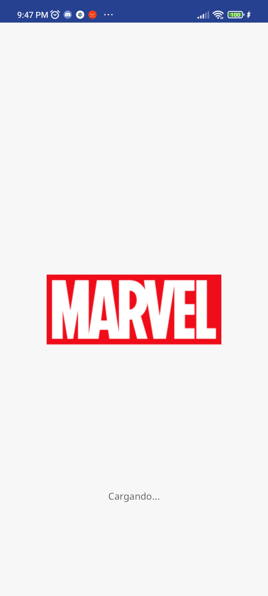
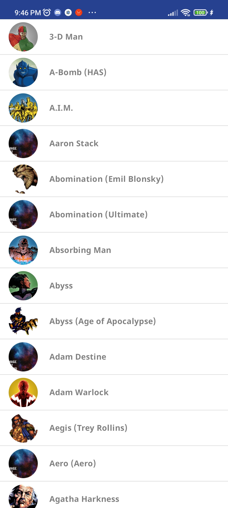
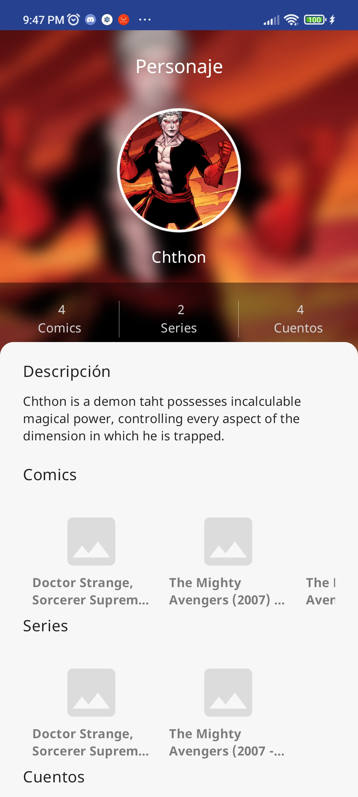

# Prueba de ingreso

En este proyecto se utilizo:

 - Retrofit
 - MVVM
 - Dagger hilt
 - Navigation components
 - Coroutines
 - Marvel API (https://developer.marvel.com)

El proyecto esta compuesto por 3 modulos:
- Splash screen
- Lista de personajes
- Perfil de personaje

NOTA: Al tener que usar el API de Marvel (No fue posible obtener el token en  https://superheroapi.com) la información mostrada en el perfil del personaje vario debido a la respuesta del endpoint.
